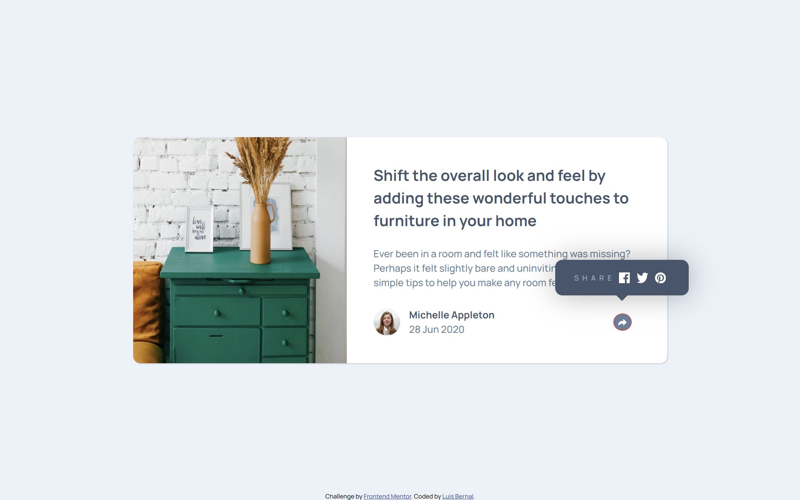

# Frontend Mentor - Article preview component solution

This is a solution to the [Article preview component challenge on Frontend Mentor](https://www.frontendmentor.io/challenges/article-preview-component-dYBN_pYFT). Frontend Mentor challenges help you improve your coding skills by building realistic projects.

## Table of contents

- [Overview](#overview)
  - [The challenge](#the-challenge)
  - [Screenshot](#screenshot)
  - [Links](#links)
- [My process](#my-process)
  - [Built with](#built-with)
  - [What I learned](#what-i-learned)
  - [Continued development](#continued-development)

## Overview

### The challenge

Users should be able to:

- View the optimal layout for the component depending on their device's screen size
- See the social media share links when they click the share icon

### Screenshot



### Links

- Solution URL: [https://github.com/FrontendMentor-Lecap/Article-Preview-Component]
- Live Site URL: [https://frontendmentor-lecap.github.io/Article-Preview-Component/]

## My process

### Built with

- Semantic HTML5 markup
- CSS custom properties
- Flexbox
- Mobile-first workflow

### What I learned

This was my first project using Javascript altough I finally complete it I took longer that what I thought. From the left image positioning to the share icon creation it was kind of tricky.
I learned the importance of adding min and max values in order to maintain an aspect ratio when the screen resolution increases. The idea is that a single component works from phones to 4k screens.
I also learned to create the triangular pattern under the socials tooltip using the following code:

```css
.socials::after {
  content: '';
  position: absolute;
  left: 50%;
  transform: translate(-50%, 50%);
  bottom: 0;
  width: 0;
  height: 0;
  border-left: 20px solid transparent;
  border-right: 20px solid transparent;
  border-top: 20px solid var(--vdrkblue);
}
```

This was the project that took the longest time to produce, they seem so easy, but in the long run tricks appear.

### Continued development

I need to keep learning and exercising Javascript in further projects. I also need to continue working on object positioning and in a cleaner code. The last part I need to continue working is in my coding speed, since I believe I take too much time that I should of, and much of it is because some parts are created with trial and error.
